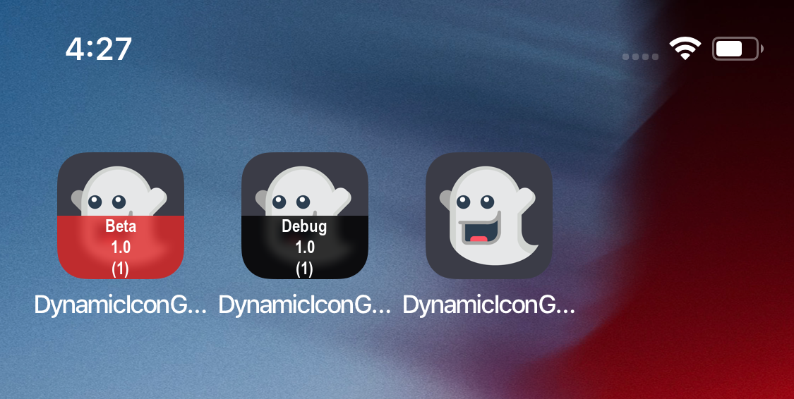

# Xcode-Dynamic-Icon-Generation
Test project to showcase the AppIcon generation during build time, using ImageMagick.
The script includes configuration, version and build number in a ribbon:

It tints the ribbon black or red depending if the configuration belongs to `staging_configurations` or `production_configurations`. The idea behind is to quickly recognize a build configured to work against a production environment, e.g.

The project contains three schemes targeting the different configurations (Debug, Beta, Release) to test the different outputs.

## License

Icons made by <a href="https://www.flaticon.com/authors/smashicons" title="Smashicons">Smashicons</a> from <a href="https://www.flaticon.com/"             title="Flaticon">www.flaticon.com</a> is licensed by <a href="http://creativecommons.org/licenses/by/3.0/"             title="Creative Commons BY 3.0" target="_blank">CC 3.0 BY</a>

